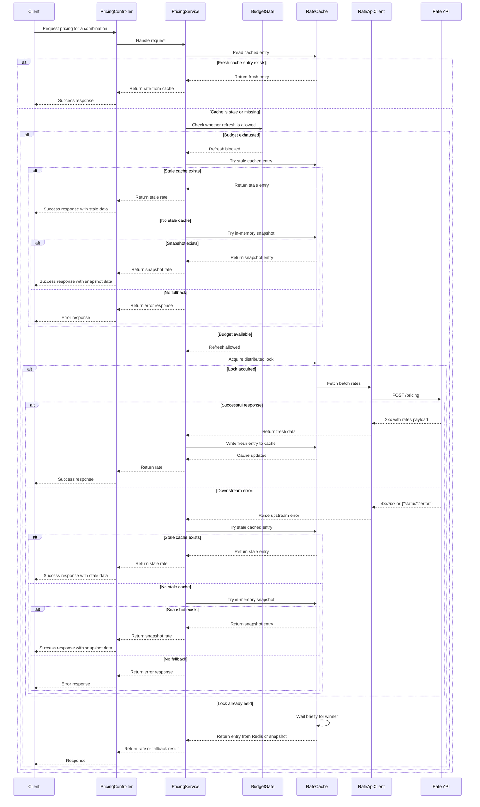

# PricingService API sequence

## Notes

- The service checks whether the cached entry is fresh before deciding to serve it directly.
- If a refresh is needed, the budget gate decides whether the upstream call is allowed.
- The cache layer uses a Redis-backed single-flight lock so only one pod updates the shared cache entry at a time.
- When the downstream API fails, the service degrades gracefully by serving stale cache data first, then the in-memory snapshot, and only then returning an error.
